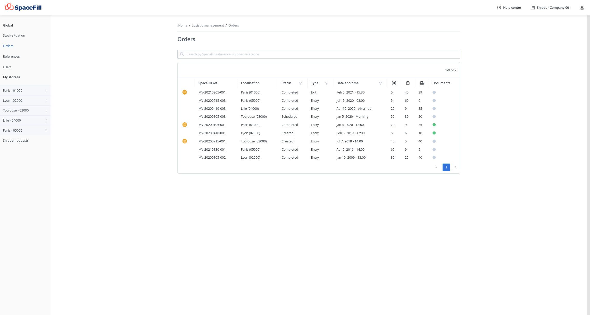
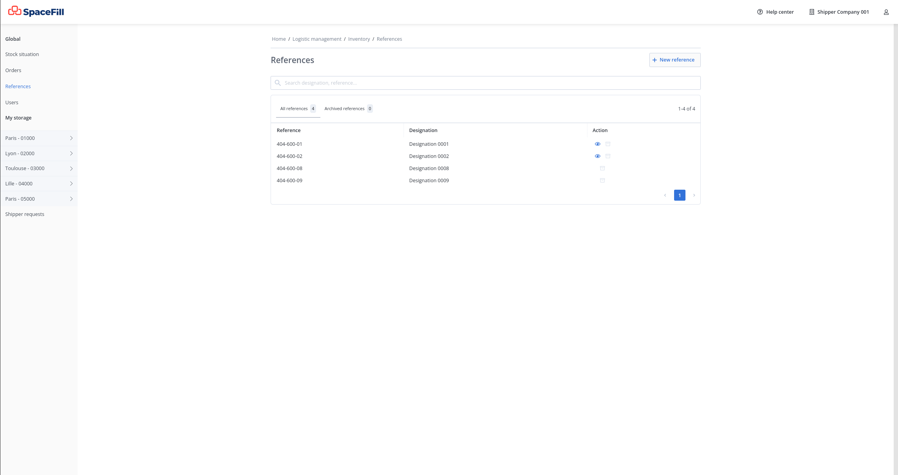

# SpaceFill OMS REST API usage tutorial

For more information about OMS (Order Management System) see this Wikipedia article: https://en.wikipedia.org/wiki/Order_management_system

This tutorial is based on [`curl`](https://en.wikipedia.org/wiki/CURL) command line tool.


* [Environments](#environments)
* [Getting started](#getting-started)
* [CRUD list](#crud-list)
* [FAQ](#faq)
  * [How can a client get orders.status update (events) information?](#how-can-a-client-get-orders.status-update-(events)-information?)
    * [Client pull method](#client-pull-method)
    * [Server push method with webhook](#server-push-method-with-webhook)

## Environments

Two environments are available:

- The `production` one at `https://api.spacefill.fr`
- The `sandbox` one at `https://api.sandbox.spacefill.fr` that can be used to try the API

To access those environments, you need:

- An API security Token
- The SpaceFill ids for the warehouses where you want store your merchandises

Ask directly this information to <gustave@spacefill.fr>.

SpaceFill API documentation reference is available at (powered by [Swagger](https://swagger.io/)):

- https://api.spacefill.fr/docs
- https://api.sandbox.spacefill.fr/docs

## Getting started

Before executing any requests you must setup your token, it must be used as `Bearer` authentification in `Authorization` header value.

Before creating an `orders`, we need to create some `master-items`:

```sh
$ curl -sLX 'POST' \
  'https://api.sandbox.spacefill.fr/v1/logistic_management/master_items/' \
  -H 'accept: application/json' \
  -H 'Authorization: Bearer secret' \
  -H 'Content-Type: application/json' \
  -d '{
  "item_reference": "POTATOES2KG",
  "designation": "Potatoes 2Kg",
  "each_barcode_type": "EAN",
  "each_barcode": "5901234123457",
  "each_quantity_by_pallet": 50,
  "each_is_stackable": true,
  "pallet_is_stackable": false,
  "each_width_in_cm": 30,
  "each_length_in_cm": 30,
  "each_height_in_cm": 30,
  "pallet_width_in_cm": 80,
  "pallet_length_in_cm": 120,
  "pallet_height_in_cm": 100,
  "pallet_gross_weight_in_kg": null,
  "pallet_net_weight_in_kg": 100,
  "each_gross_weight_in_kg": 2
}'
```

```sh
$ curl -sLX 'POST' \
  'https://api.sandbox.spacefill.fr/v1/logistic_management/master_items/' \
  -H 'accept: application/json' \
  -H 'Authorization: Bearer secret' \
  -H 'Content-Type: application/json' \
  -d '{
  "item_reference": "CARROT1KG",
  "designation": "Carrot 1Kg",
  "each_barcode_type": "EAN",
  "each_barcode": "5901834823459",
  "each_quantity_by_pallet": 100,
  "each_is_stackable": true,
  "pallet_is_stackable": false,
  "each_width_in_cm": 15,
  "each_length_in_cm": 10,
  "each_height_in_cm": 20,
  "pallet_width_in_cm": 80,
  "pallet_length_in_cm": 120,
  "pallet_height_in_cm": 100,
  "pallet_gross_weight_in_kg": null,
  "pallet_net_weight_in_kg": 70,
  "each_gross_weight_in_kg": 1
}'
```

After these `master-items` creation, we can create an entry `order` with those items:

```sh
$ curl -sLX 'POST' \
  'https://api.sandbox.spacefill.fr/v1/logistic_management/orders/entry' \
  -H 'accept: application/json' \
  -H 'Authorization: Bearer secret' \
  -H 'Content-Type: application/json' \
  -d '{
  "shipper_order_reference": "REF_01",
  "warehouse_id": "d8bdc728-242b-4039-99a3-0aa239650011",
  "comment": "Additional comment",
  "planned_execution_datetime_range": {
    "datetime_from": "2021-09-28T15:12:41.538Z",
    "datetime_to": "2021-09-28T15:12:41.538Z"
  },
  "carrier_name": "Carrier X",
  "carrier_phone_number": "+33610101010",
  "transport_management_owner": "PROVIDER",
  "entry_expeditor": "Expeditor X",
  "entry_expeditor_address_line1": "123 Boulevard X",
  "entry_expeditor_address_line2": "",
  "entry_expeditor_address_line3": "",
  "entry_expeditor_address_zip": "75020",
  "entry_expeditor_address_city": "Paris",
  "entry_expeditor_address_country": "France",
  "entry_expeditor_planned_datetime_range": {
    "datetime_from": "2021-09-28T15:12:41.538Z",
    "datetime_to": "2021-09-28T15:12:41.538Z"
  },
  "order_items": [
    {
      "master_item_id": "13acc10a-a6ab-4099-b600-fb33fa6c0001",
      "batch_id": "e4f77256-304a-4911-a1eb-9f6d47ca0001",
      "item_packaging_type": "PALLET",
      "expected_quantity": 1
    },
    {
      "master_item_id": "13acc10a-a6ab-4099-b600-fb33fa6c0002",
      "batch_id": "e4f77256-304a-4911-a1eb-9f6d47ca0005",
      "item_packaging_type": "PALLET",
      "expected_quantity": 1
    }
  ]
}'
```

Or an exit `order` with those items:

```sh
$ curl -sLX 'POST' \
  'https://api.sandbox.spacefill.fr/v1/logistic_management/orders/exit' \
  -H 'accept: application/json' \
  -H 'Authorization: Bearer secret' \
  -H 'Content-Type: application/json' \
  -d '{
  "shipper_order_reference": "REF_01",
  "warehouse_id": "d8bdc728-242b-4039-99a3-0aa239650011",
  "comment": "Additional comment",
  "planned_execution_datetime_range": {
    "datetime_from": "2021-09-28T15:12:41.538Z",
    "datetime_to": "2021-09-28T15:12:41.538Z"
  },
  "carrier_name": "Carrier X",
  "carrier_phone_number": "+33610101010",
  "transport_management_owner": "PROVIDER",
  "exit_final_recipient": "Recipient X",
  "exit_final_recipient_address_line1": "123 Boulevard X",
  "exit_final_recipient_address_line2": "",
  "exit_final_recipient_address_line3": "",
  "exit_final_recipient_address_zip": "75020",
  "exit_final_recipient_address_city": "Paris",
  "exit_final_recipient_address_country": "France",
  "exit_final_recipient_planned_datetime_range": {
    "datetime_from": "2021-09-28T15:12:41.538Z",
    "datetime_to": "2021-09-28T15:12:41.538Z"
  }
  "order_items": [
    {
      "master_item_id": "13acc10a-a6ab-4099-b600-fb33fa6c0001",
      "batch_id": "e4f77256-304a-4911-a1eb-9f6d47ca0001",
      "item_packaging_type": "PALLET",
      "expected_quantity": 1
    },
    {
      "master_item_id": "13acc10a-a6ab-4099-b600-fb33fa6c0002",
      "batch_id": "e4f77256-304a-4911-a1eb-9f6d47ca0005",
      "item_packaging_type": "PALLET",
      "expected_quantity": 1
    }
  ]
}'
```

You can now view your data on Spacefill app at `https://app.spacefill.fr`:

- To view your orders go to [`https://app.spacefill.fr/logistic-management/orders/`](https://app.spacefill.fr/logistic-management/orders/)
  [](./spacefill-app-orders-view.png)
- To view your master_items go to [`https://app.spacefill.fr/logistic-management/inventory/items/`](https://app.spacefill.fr/logistic-management/inventory/items/)
  [](./spacefill-app-master-items-view.png)

## CRUD list

You can get more information about CRUD on each resource using the following links:

- [Orders](./crud/orders.md)

## FAQ

### How can a client get orders.status update (events) information?

Two implementations are possible: « Pull method ([polling](https://en.wikipedia.org/wiki/Polling_(computer_science))) » or « [Push method](https://en.wikipedia.org/wiki/Push_technology) ([with Webhook](https://en.wikipedia.org/wiki/Webhook)) »

#### Client pull method

Client execute for instance all 5min this HTTP request with `updated_after` parameter with value `NOW - 6mins` :

```sh
curl -X 'POST' \
  'https://api.sandbox.spacefill.fr/v1/logistic_management/orders/?updated_after=2021-09-10T20:10:00' \
  -H 'accept: application/json' \
  -H 'Authorization: Bearer secret' \
{
  "total": 0,
  "items": [
  ]
}
```

If the result is empty, the client has nothing to do.

5 minutes later, the client executes the same request again:

```sh
curl -X 'POST' \
  'https://api.sandbox.spacefill.fr/v1/logistic_management/orders/?updated_after=2021-09-10T20:10:00' \
  -H 'accept: application/json' \
  -H 'Authorization: Bearer secret' \
{
  "total": 1,
  "items": [
    {
      "id": "3fa85f64-5717-4562-b3fc-2c963f66afa6",
      ...
      "status": "COMPLETED_ORDER_STATE",
      ...
    }
  ]
}
```

Now, in this example, there is one item in response, so the client can handle this item, read the new status value...

#### Server push method with webhook

The client can set up a webhook with the following HTTP request:

```sh
$ curl -X 'POST' \
  'http://127.0.0.1:5004/v1/logistic_management/orders/hooks' \
  -H 'accept: application/json' \
  -H 'Authorization: Bearer secret' \
  -H 'Content-Type: application/json' \
  -d '{
  "target_url": "https://example.com/foobar/"
}'
{
  "result": "ok"
}
```

Then, with this webhook configured, every order update will send a POST HTTP request to https://example.com/foobar/ url with the order's data in POST payload, so that the client can handle all order update events in "real time".
